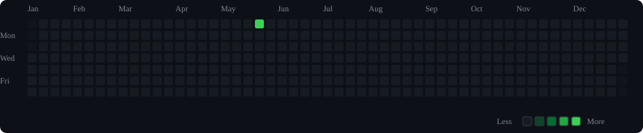
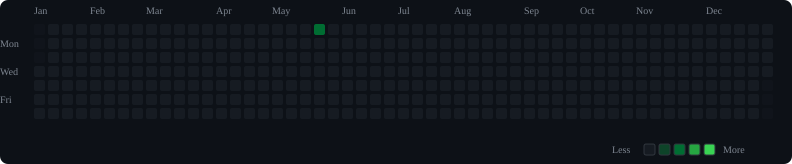
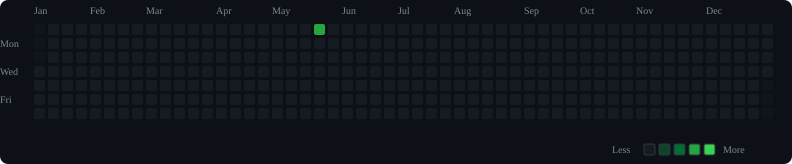

# Daily Commit

A GitHub-style personal habit tracker.

Este repositorio genera gráficos de constancia inspirados en el contribution graph de GitHub, pero separados por áreas de vida.

## General



## Actividad física



## Estudio


## Trabajo


## Alimentación



## Cómo registrar el día

Edita `logs/2026.yml` y añade o modifica la fecha correspondiente.

```yaml
"2026-05-18":
  physical:
    walk: true
    workout: false
    core: true
    mobility: false

  study:
    abap: true
    course: true
    reading: false
    practice: true

  work:
    deep_work: true
    tickets: true
    documentation: false
    no_distractions: false

  nutrition:
    water: true
    protein: true
    no_ultraprocessed: false
    controlled_dinner: true
```

Después de cada cambio en `config/`, `logs/` o `scripts/`, GitHub Actions regenera los SVG de `assets/`.

## Leyenda

- Gris: sin actividad registrada.
- Verde oscuro: cumplimiento bajo.
- Verde medio: cumplimiento parcial.
- Verde intenso: buen cumplimiento.
- Verde brillante: día completo.
